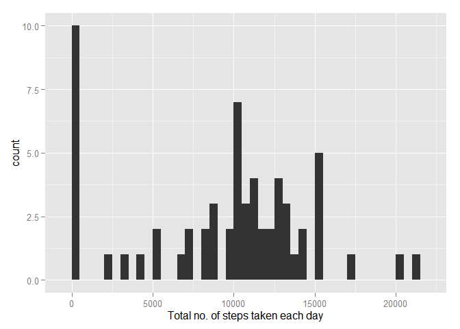
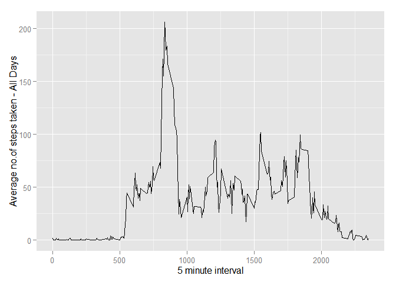
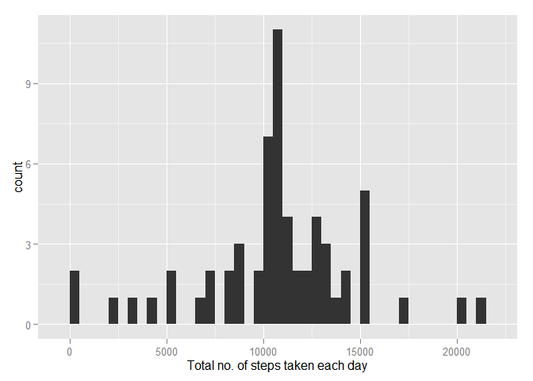
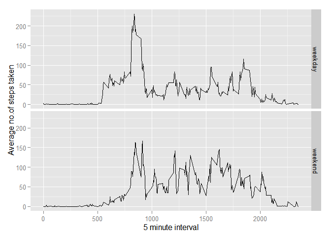

# Reproducible Research: Peer Assessment 1


## Loading and preprocessing the data


```r
if(!file.exists("activity.csv")){
    unzip("activity.zip")
}

actvtyData <- read.csv("activity.csv")
```


## What is mean total number of steps taken per day?

```r
library(ggplot2)
```

```
## Warning: package 'ggplot2' was built under R version 3.2.3
```

```r
totsteps <- tapply(actvtyData$steps, actvtyData$date, FUN=sum, na.rm=TRUE)
qplot(totsteps, binwidth=500, xlab="Total no. of steps taken each day")
```

 

```r
raw_mean<-mean(totsteps, na.rm=TRUE)
raw_median<-median(totsteps, na.rm=TRUE)
```
Mean is 9354.2295082 and median is 10395

## What is the average daily activity pattern?


```r
average <- aggregate(x=list(steps=actvtyData$steps), by=list(interval=actvtyData$interval),
                      FUN=mean, na.rm=TRUE)
ggplot(data=average, aes(x=interval, y=steps)) +
    geom_line() +
    xlab("5 minute interval") +
    ylab("Average no.of steps taken - All Days")
```

 

```r
max_step_int<-average[which.max(average$steps),1]
```
The  5-minute interval, on average across all days, containing the maximum number of steps, is 835


## Imputing missing values

```r
num_missing_val<- length(which(is.na(actvtyData$steps)))
# How many missing
```
There are 2304 missing values


# Replace each missing value with the mean value of its 5-minute interval

```r
fill.value <- function(steps, interval) {
    filled <- NA
    if (!is.na(steps))
        filled <- c(steps)
    else
        filled <- (average[average$interval==interval, "steps"])
    return(filled)
}
filled.actvtyData <- actvtyData
filled.actvtyData$steps <- mapply(fill.value, filled.actvtyData$steps, filled.actvtyData$interval)
```

## ------------------------------------------------------------------------

```r
totsteps <- tapply(filled.actvtyData$steps, filled.actvtyData$date, FUN=sum)
qplot(totsteps, binwidth=500, xlab="Total no. of steps taken each day - Imputed Missing Values")
```

 

```r
imp_mean<-mean(totsteps)
imp_median<-median(totsteps)
```
After imputation, Mean is 1.0766189\times 10^{4} and median is 1.0766189\times 10^{4}. Since missing values are replaced by mean values, after imputation mean and median values are higher than raw values

## Are there differences in activity patterns between weekdays and weekends?


```r
## ------------------------------------------------------------------------
wkday_wkend <- function(date) {
    day <- weekdays(date)
    if (day %in% c("Monday", "Tuesday", "Wednesday", "Thursday", "Friday"))
        return("weekday")
    else if (day %in% c("Saturday", "Sunday"))
        return("weekend")
    
}
filled.actvtyData$date <- as.Date(filled.actvtyData$date)
filled.actvtyData$day <- sapply(filled.actvtyData$date, FUN=wkday_wkend)

## ------------------------------------------------------------------------
average <- aggregate(steps ~ interval + day, data=filled.actvtyData, mean)
ggplot(average, aes(interval, steps)) + geom_line() + facet_grid(day ~ .) +
    xlab("5 minute interval") + ylab("Average no.of steps taken")
```

 


The weekday chart shows higher activity from early morning till 10 am while the weekend chart shows higher activity between 10 am and 8 pm (2000 hrs)
